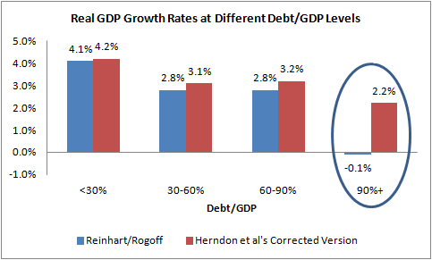
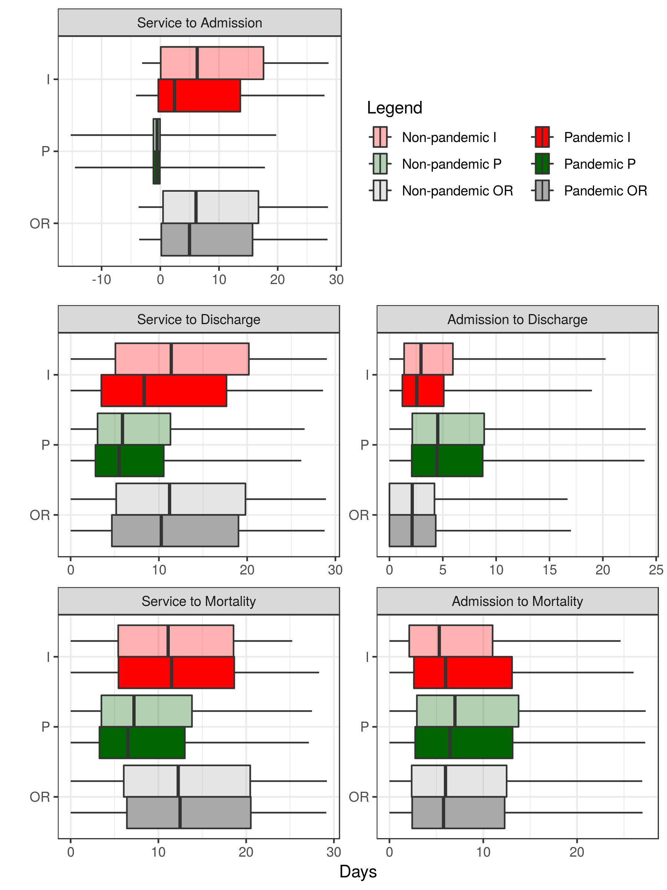
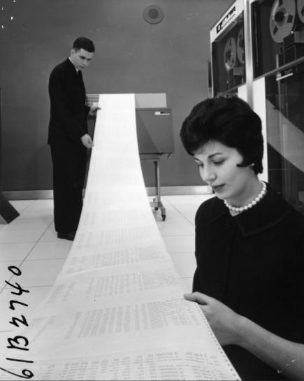

<!-- 
apa.csl is a slightly hacked version of APA 
  (modified for "et al" after 2 authors in text)
-->
<!-- .refs is style for reference page (small text) -->
<style>
.refs {
   font-size: 16px;
}
h2 { 
 color: #3399ff;		
}
h3 { 
 color: #3399ff;		
}
.title-slide {
   background-color: #55bbff;
}
</style>
<!--    content: url(https://i.creativecommons.org/l/by-sa/4.0/88x31.png)
>
<!-- Limit image width and height -->
<style type="text/css">
img {     
  max-height: 560px;     
  max-width: 800px; 
}
</style>

# reproducibility

## reproducibility crisis in science

- many scientific findings can't be repeated
- many factors
- focus today: data analysis and complexity

## data analysis in public health

- heterogeneous data sources
- often complicated analyses
- **very easy** to screw up!
- analyses often need to be repeated
     - periodic updates
	 - upstream data corrections
	 - re-use for different problems
- institutional turnover

## why Excel?

- ubiquitous 
- intuitive/visual
- extensions: VBA, pivot tables
- dynamic updating

## why *not* Excel?

- file formats not useful outside MS ecosystem
- mangles dates
- hidden information
- point-and-click impedes reproducibility

## A famous Excel mistake [@plumer_is_2013]



## what is R?

- a statistics package
- "a programming language and free software environment for statistical computing and graphics"
- based on S language (1980s, Bell Labs); written in 1990s by NZ academics

## why R?

- specifically designed for statistics and data analysis
- active community ($\approx$ 14,000 contributed packages)
- scripted analyses
- output: figures, tables, reports (docx/PDF), presentations (HTML), dashboards ([shiny](https://shiny.rstudio.com/)), ...
- data analysis **pipeline**

## best practices [@wilson_good_2017]

- use version control
- name files sensibly
- raw data is sacred; back it up & don't mess with it
- consider [Data Carpentry](https://datacarpentry.org/)

## Alternatives

- Python, Java ...
- [OpenRefine](http://openrefine.org)

## Big data

- Analyzed OHIP data 
- 2006-2010: 1.34 billion records overall
- looked at individuals with pneumonia/influenza diagnoses who were also hospitalized
- down to "only" 7.6 million individuals

## time series {.centered}


## event delays {.centered}



# Intro to R/tidyverse

## tidyverse 

- set of R packages: https://www.tidyverse.org/
- big ideas
     - verbs for data analysis
     - piping

## tidyverse: main verbs

- `filter(df,condition)`: choose rows
- `select(df,condition)`: choose columns
- `mutate(df,var=...)`: change or add variables
- `arrange(df,var)`: change order of rows
- `<-` (base R): assignment to a variable

## tibbles

- short for "tables"
- rectangular tables of variables; each column is a variable
- generally operate *within* tibbles,  
but can also combine them in various ways

## operators

- comparison: `==` (equals), `>`, `<`, `>=`, `<=`
- also: `%in%`, `&` (AND), `|` (OR), `!` (NOT)
- combining: `c()`
- `-`: leave out, e.g. `select(-stuff_i_dont_want)`

## tidyverse: split-apply-combine

- `group_by()`: adds grouping information
- `summarise()`: collapses variables to a single value
- e.g.
```{r split_apply, eval=FALSE,echo=TRUE}
x <- group_by(x,course)
summarise(x,mean_score=mean(score),sd_score=sd(score))
```
          
## tidyverse: piping

- `%>%` operator
- directs result of previous operation to next function,  
as first argument
- e.g.

```{r pipe_ex,eval=FALSE,echo=TRUE}
d_output <- (d_input
    %>% select(cols)
    %>% filter(cond1,cond2)
    %>% mutate(...)
)
```

## reshaping data (`tidyr` package) {.columns-2}

- `gather(data,key,value,<vars to include/exclude>)`
    - wide to long
	- convert human-convenient to computer-convenient form
- `spread(data,key,value)`
    - long to wide



## graphics: ggplot

- **g**rammar of **g**raphics

- @Wilkinson1999, @wickham_ggplot2_2009
- assign **mappings** between variables in data and graph elements
    - x, y position; colour, fill, shape, size, ...
	- **geoms**: point, line, box-and-whisker plot, violin plot ...
	- **facets**: break data into subplots
	- layered graphs
    - [basic examples](https://r4stats.com/examples/graphics-ggplot2/), [extensions](http://www.ggplot2-exts.org/gallery/) (animation, networks, interactive graphics ...)

## references {.refs}
